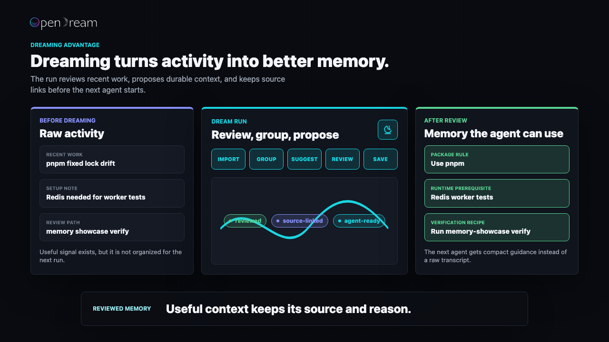
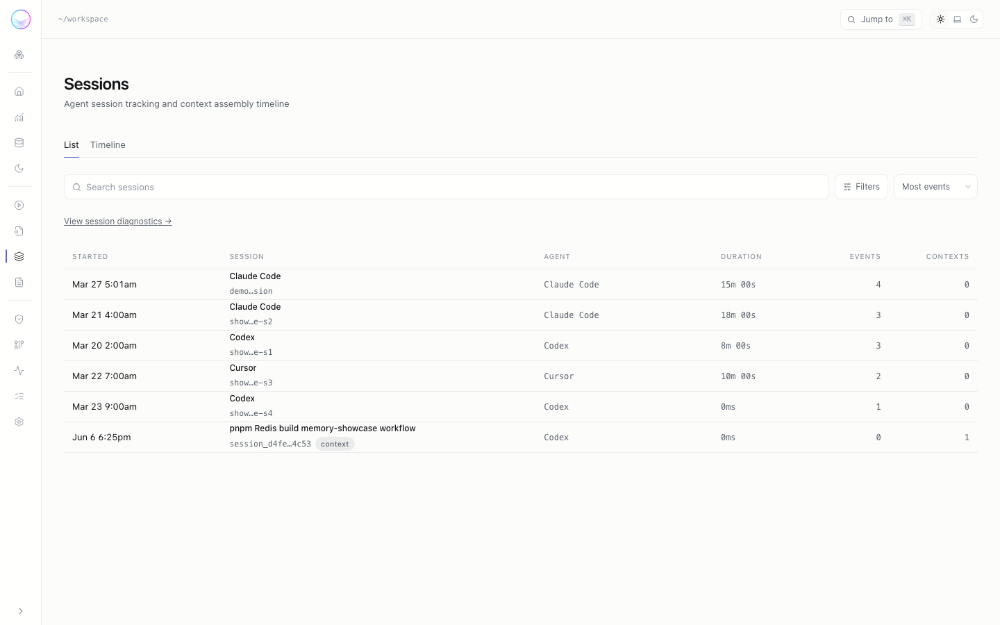
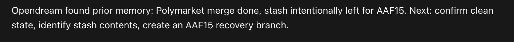
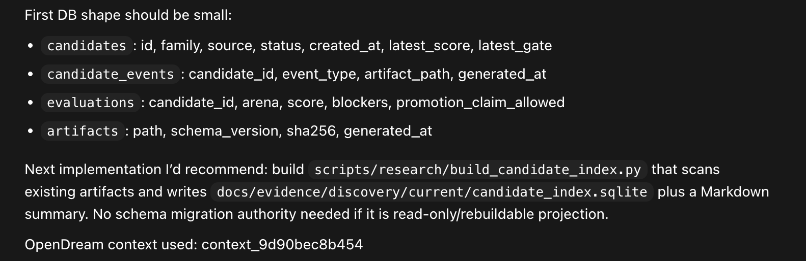
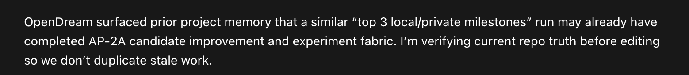

# OpenDream

<p align="center">
  <picture>
    <source media="(prefers-color-scheme: dark)" srcset="./frontend/assets/logo/wordmark/vector/opendream_wordmark_primary_ink_dark.svg">
    <source media="(prefers-color-scheme: light)" srcset="./frontend/assets/logo/wordmark/vector/opendream_wordmark_primary_ink_light.svg">
    
  </picture>
</p>

[](https://github.com/pylit-ai/opendream/actions/workflows/ci.yml)
[](https://pypi.org/project/opendream/)
[](https://www.python.org/downloads/)
[](./LICENSE)

## Agent context that improves between sessions.

**Open, local-first memory for AI agents.**

Capture what happened, retrieve what matters, and review what changed. OpenDream helps agents carry useful context across projects, tools, and sessions while keeping boundaries, sources, and review visible.

Closed products are starting to dream. OpenDream makes agent memory open, local, portable, and reviewable. "Dreaming" means background memory review and cleanup, not an opaque model behavior.

<p align="center">
  
</p>

<p align="center">
  <a href="./docs/assets/demos/product-motion/09-dreaming-social-hook-dark.mp4">Play video</a>
</p>

<picture>
  <source media="(prefers-color-scheme: dark)" srcset="./docs/assets/demos/ui/opendream-ui-overview-dark.gif">
  <source media="(prefers-color-scheme: light)" srcset="./docs/assets/demos/ui/opendream-ui-overview.gif">
  
</picture>

The observability UI shows recent agent activity, selected memories, context-use audit records, review decisions, and workspace health without making you read raw JSON first. Full UI demo gallery: [`docs/showcase/ui-demos.md`](./docs/showcase/ui-demos.md).

### Multiple agents, one workspace memory plane

Codex, Claude Code, Cursor, and other agents can contribute across sessions in
the same workspace. OpenDream keeps those events and prepared contexts in one
local store with agent attribution, so a later agent can inspect and reuse what
came before without replacing its built-in memory.

<picture>
  <source media="(prefers-color-scheme: dark)" srcset="./docs/assets/demos/ui/dark-shared-memory-sessions.png">
  <source media="(prefers-color-scheme: light)" srcset="./docs/assets/demos/ui/light-shared-memory-sessions.png">
  
</picture>

Watch the full session and diff flow in the [UI demo gallery](./docs/showcase/ui-demos.md).

**OpenDream memory in real agent sessions**

<p align="center">
  
  <br>
  
  <br>
  
</p>

| If you want to… | Start here |
|-----------------|------------|
| Try it in a few commands | [Quick start](#quick-start) |
| See multiple agents share workspace memory | [Shared agent memory demo](./docs/showcase/ui-demos.md#multiple-agents-one-memory-plane) |
| Run the CLI memory demo | [90-second memory showcase](./docs/showcase/memory-showcase.md) |
| Understand the memory lifecycle | [Dreaming memory change control](./docs/technical-notes/dreaming-memory-change-control.md) |
| Compare memory approaches | [Comparison guide](./docs/comparison.md) |
| Wire it into an agent runtime | [Integration at a glance](#integration-at-a-glance) |
| Browse memory in a browser | [Observability UI](#observability-ui) |
| Contribute | [Contributing](#contributing) (expandable) |

**Current status:** OpenDream is alpha software. Codex is currently the most tested path; other integrations depend on each host's hooks, rules, context files, or CLI surface. Current evals are fixture-driven release checks, not broad real-world benchmarks. Memory can hurt when it is stale, over-broad, or incorrectly scoped, so reviewability is part of the product goal rather than a finished claim.

---

## Quick start

```bash
uv tool install opendream   # or: pipx install opendream
opendream init --workspace .
opendream verify activation-capture --workspace . --targets configured
opendream status --workspace .
opendream serve
opendream deactivate --workspace .
```

Run the self-contained showcase in a disposable workspace:

```bash
opendream eval showcase --scenario agent-workspace-showcase --workspace .tmp/opendream-showcase
opendream observe serve --workspace .tmp/opendream-showcase
```

If your installed CLI does not show `activate`, `verify`, `deactivate`, `semantic`, or
`eval`, upgrade with `uv tool upgrade opendream` or reinstall from Git. After
upgrading, `opendream verify --help`, `opendream semantic --help`, and
`opendream eval --help` are quick checks that your install matches the docs.

Bleeding-edge from Git (overwrites the tool env): `uv tool install --force "opendream @ git+https://github.com/pylit-ai/opendream.git"`.

Install checks, upgrade notes, known limitations, and clean-room provenance live
in [`docs/launch-readiness.md`](./docs/launch-readiness.md),
[`docs/known-limitations.md`](./docs/known-limitations.md), and
[`docs/provenance.md`](./docs/provenance.md).

<details>
<summary><strong>CLI demos for docs and operators</strong></summary>

OpenDream's first-run path is intentionally small. These clips are useful beside command reference docs; the UI application tour above is the better first look.

| Demo | What it shows |
|------|---------------|
|  | `init` with default activation, status, and deactivation in a local workspace. |
|  | `prepare-context` turns durable repo memory into prompt-ready agent context. |
|  | Unrelated prompts return an explicit no-match instead of injecting stale or irrelevant memory. |
|  | The showcase eval compares stateless vs memory-assisted answers and keeps negative controls in the report. |

UI demo gallery: [`docs/showcase/ui-demos.md`](./docs/showcase/ui-demos.md). CLI demo gallery: [`docs/showcase/cli-demos.md`](./docs/showcase/cli-demos.md).
Brand motion assets: [`frontend/assets/animation/README.md`](./frontend/assets/animation/README.md).

</details>

<details>
<summary><strong>Install options</strong> (venv, editable checkout, PEP 668)</summary>

**PyPI (recommended once published)** — use an isolated tool env to avoid system Python restrictions (PEP 668):

```bash
uv tool install opendream
# or: pipx install opendream
opendream --help
```

**From Git** (same idea; pin with `@main` / `@v0.1.0` where your installer allows):

```bash
uv tool install "opendream @ git+https://github.com/pylit-ai/opendream.git"
# or: pipx install git+https://github.com/pylit-ai/opendream.git
```

**Repo checkout** (contributors):

```bash
make setup
.venv/bin/opendream --help
```

Manual equivalent: `python3 -m venv .venv && .venv/bin/pip install -e .` from the repo root. Module fallback: `python3 -m opendream.cli --help`.

If `python3` is missing, install from [python.org](https://www.python.org/downloads/) or your OS package manager.

**System dependencies** — OpenDream uses `jq` to parse JSON in hook scripts (for Claude Code integration). Install via your OS package manager:

```bash
# macOS
brew install jq

# Ubuntu / Debian
sudo apt-get install jq

# Other systems
# See: https://jqlang.github.io/jq/download/
```

</details>

---

## Integration at a glance

OpenDream is an **activation-first CLI**. 

Codex is currently the most tested path. Other integrations expose context through CLI commands, rules, hooks, or generated files depending on host support. A built-in target means OpenDream can generate the integration surface; it does not mean every host executes hooks natively.

**You do not need to replace existing agent memory.** OpenDream keeps a separate workspace-local store and can run alongside built-in memory from Codex, Claude Code, or another agent. Activation adds OpenDream-managed integration surfaces; preview them with `activation-plan`, skip them with `init --no-activate-configured`, or remove them later with `deactivate`. See the [FAQ](./docs/FAQ.md#do-i-need-to-replace-my-existing-memory-system).

```bash
opendream init --workspace .
opendream verify activation-capture --workspace . --targets configured
opendream status --workspace .
opendream activate --workspace . --repair
opendream deactivate --workspace .
```

The lower-level runtime remains available, but it is not the main mental model.

| Command | Role |
|---------|------|
| `emit-event` | Append schema-valid evidence to the store |
| `maintain` | Run extract + consolidate when work qualifies; returns structured **`status`** / **`reason`** when skipping (not a silent no-op) |
| `automation ...` | Manage recurring projection jobs that stay separate from canonical durable memory |
| `prepare-context` | Retrieval surface for the next task (prompt-ready output) |

Agent integration details (workspace vs cwd, `memory_layout`, `empty_reason` / `hints`, JSON version): [`docs/agent-integrations.md`](./docs/agent-integrations.md).

**Recommended activation workflow**

1. `opendream init --workspace .` — create the memory layout and activate configured agent surfaces by default.
2. `opendream activation-plan --workspace . --targets configured` — optional dry-run: see which surfaces are detected. Use `--targets all-supported` to preview every built-in agent target.
3. `opendream verify activation-capture --workspace . --targets configured` — run generated hooks in the selected workspace and prove diagnostic memory capture.
4. `opendream status --workspace .` — report the latest capture verification state (`never_run`, `passed`, or `failed`) with the next action.
5. `opendream activate --workspace . --repair` — restore drifted managed files and hook entries.
6. `opendream doctor --workspace . --surface agents` — inspect managed surfaces without writing diagnostic memory.

**Compatibility matrix**

| Agent/runtime | Built-in target | Integration status | Notes |
|---------------|-----------------|--------------------|-------|
| Claude Code and Claude CoWork | `claude-code` | Native hooks | Uses Claude Code `UserPromptSubmit` / `Stop` hooks in `.claude/settings.json`; Claude CoWork should use this path when backed by Claude Code project hooks. |
| OpenAI Codex CLI | `codex` | Managed wrapper plus `AGENTS.md` | Codex is one supported example target, not a product requirement. |
| Cursor | `cursor` | Instruction-only rules plus shell hooks | OpenDream writes `.cursor/rules/opendream.mdc`; the host or agent must run the hook commands. |
| GitHub Copilot repository instructions | `github-copilot` | Instruction-only repository guidance plus shell hooks | Useful when Copilot can read repo instructions; hook execution remains operator/host-owned. |
| Hermes Agent | `hermes` | Instruction-only `.hermes.md` plus shell hooks | Hermes natively reads `.hermes.md`, `HERMES.md`, and `AGENTS.md`; OpenDream uses `.hermes.md` so it does not compete with shared repo instructions. |
| OpenClaw | `openclaw` | Native config and event map | Uses `.openclaw/config.json`, an OpenDream event map, and generated pre/post hook scripts. |
| AGENTS.md-style community agents | none yet | Generic/manual | Use `prepare-context` before work and `emit-event` + `maintain` after work, or add a small adapter once the host exposes stable hooks/config files. |
| Scripts, daemons, CI jobs, and custom runtimes | n/a | Direct CLI | Call the same CLI sequence directly; no named agent adapter is required. |

For a tool that was not detected yet, run e.g. `opendream activate --workspace . --targets cursor` once to create `.cursor/rules/opendream.mdc` and hook scripts.

Instruction-only targets (Cursor rules, `.github/copilot-instructions.md`, `.hermes.md`) ship the same generic pre/post shell hooks as the Codex example target; the agent must still run those commands when the host has no native OpenDream hooks.

Corrections worth knowing:

- Treat **`maintain`** as the documented maintenance entrypoint even if the CLI exposes more commands.
- **First-party surface** = this CLI. Hook/script glue is **operator-owned** unless you add it.
- **No first-party MCP server** in this repo; [`docs/mcp/servers.md`](./docs/mcp/servers.md) is a template for inventorying MCP, not a shipped server.

<details>
<summary><strong>Agent and architecture references</strong> (optional reading)</summary>

Human-facing behavior is described in this README and in [`AGENTS.md`](./AGENTS.md). Machine-readable runtime contracts live under [`opendream/schema/`](./opendream/schema/).

</details>

---

## Workspace, Runtime, and Observability

OpenDream stores canonical state per workspace under `.opendream/`. The multi-workspace catalog is a derived, machine-local convenience index; workspace memory stays the source of truth and scans only run on roots you configure.

```bash
opendream workspace list
opendream serve
opendream observe serve --workspace "$PWD" --port 8000  # explicit workspace/port fallback
```

Semantic-first mode is a configuration posture, not an automatic readiness claim. If the selected semantic path cannot run, OpenDream reports a **degraded** state with a reason and next action; `prepare-context` should still use progressive disclosure and pruning evidence so recalled context stays inspectable.

Use the detailed operator guide for workspace catalog setup, upgrade/backfill flows, runtime commands, generated data locations, global/project stores, semantic mode, automation, eval notes, and full CLI examples: [`docs/operator-guide.md`](./docs/operator-guide.md).

---
## Documentation

| Doc | Purpose |
|-----|---------|
| [docs/technical-notes/dreaming-memory-change-control.md](./docs/technical-notes/dreaming-memory-change-control.md) | Canonical memory lifecycle and review model |
| [docs/comparison.md](./docs/comparison.md) | Capability-level comparison with static files, RAG, hosted APIs, and managed memory |
| [docs/security-local-first.md](./docs/security-local-first.md) | Local-first defaults, explicit provider paths, and trust boundaries |
| [docs/design-partner-workloads.md](./docs/design-partner-workloads.md) | Real workflows needed to validate where memory helps or fails |
| [docs/FAQ.md](./docs/FAQ.md) | Adoption, coexistence, privacy, benchmarks, and setup questions |
| [docs/showcase/memory-showcase.md](./docs/showcase/memory-showcase.md) | 90-second memory demo |
| [docs/agent-integrations.md](./docs/agent-integrations.md) | Agent integration guide |
| [docs/operator-guide.md](./docs/operator-guide.md) | Workspace catalog, runtime commands, observability, generated data, eval notes, and full CLI examples |
| [docs/automation/dream-task-playbook.md](./docs/automation/dream-task-playbook.md) | Automation and recurring memory tasks |
| [docs/architecture/overview.md](./docs/architecture/overview.md) | Architecture overview |
| [docs/benchmarks/methodology.md](./docs/benchmarks/methodology.md) | Benchmark methodology |
| [docs/claims.md](./docs/claims.md) | Evidence-backed claims |
| [docs/known-limitations.md](./docs/known-limitations.md) | Known limitations |
| [docs/provenance.md](./docs/provenance.md) | Clean-room provenance |
| [docs/contributor-reference.md](./docs/contributor-reference.md) | Contributor smoke tests, verification targets, release notes, and full CLI examples |
| [SECURITY.md](./SECURITY.md) | Security policy |
| [CONTRIBUTING.md](./CONTRIBUTING.md) | Contributor guide |

OpenDream does not send telemetry by default. Provider/API-key paths are
operator-configured execution paths and are separate from analytics or tracking.

---

## Contributing

For local development, run:

```bash
make sync
make verify
make release-check
```

Contributor workflow, smoke tests, automation examples, verification targets, and maintainer release notes live in [`docs/contributor-reference.md`](./docs/contributor-reference.md). Security reports go through [`SECURITY.md`](./SECURITY.md); general contribution guidance lives in [`CONTRIBUTING.md`](./CONTRIBUTING.md).
