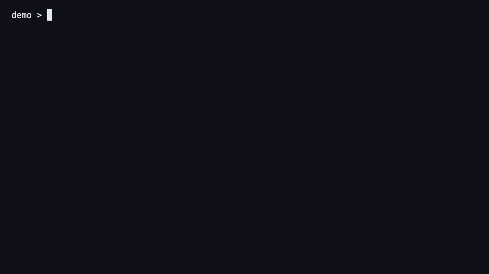
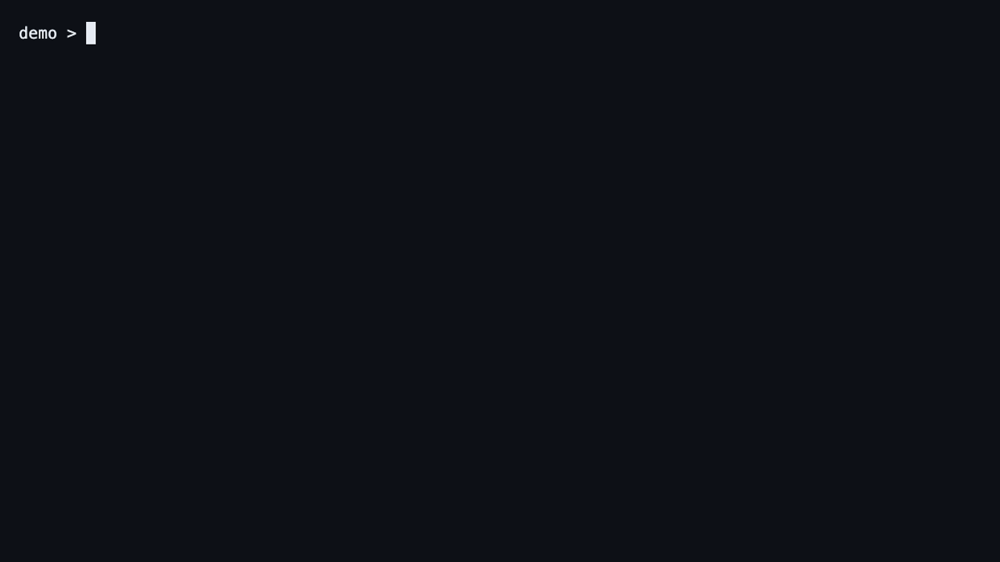
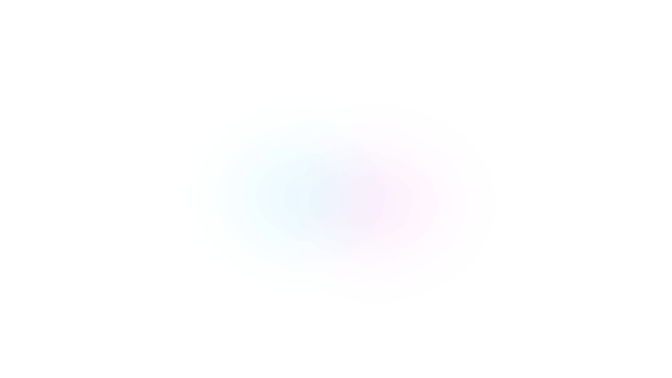

# OpenDream CLI demos

  <picture>
    <source media="(prefers-color-scheme: dark)" srcset="../../frontend/assets/logo/wordmark/vector/opendream_wordmark_primary_ink_dark.svg">
    <source media="(prefers-color-scheme: light)" srcset="../../frontend/assets/logo/wordmark/vector/opendream_wordmark_primary_ink_light.svg">
    
  </picture>

Short recorded demos for command reference pages, docs, launch notes, and walkthroughs. For a first product look, start with the browser UI recordings in [`ui-demos.md`](./ui-demos.md). Each CLI demo is rendered from the same deterministic fixture path used by the CLI tests and showcase docs.

## First-run path

Creates a local OpenDream workspace, lets `init` activate configured agent surfaces by default, and checks human-readable status.

## Agent context and safety

Shows `prepare-context` selecting prior repo guidance for the next coding-agent task.

Shows an unrelated query returning a clear no-match instead of injecting irrelevant memory.

## Evaluation proof

Runs the coding-agent showcase eval and summarizes stateless score, memory-assisted score, lift, and negative controls.

## Advanced runtime paths

Imports local transcript sessions, runs a transcript-backed dream pass, then refreshes the read-only observability index.

Shows the versioned machine-readable CLI contract for agents that need stable command inventory.

Scaffolds a recurring feature-radar dream job while keeping projections separate from canonical durable memory.

## Brand motion

  <picture>
    <source media="(prefers-color-scheme: dark)" srcset="../../frontend/assets/animation/video/opendream_splash_wordmark_dark_preview.gif">
    <source media="(prefers-color-scheme: light)" srcset="../../frontend/assets/animation/video/opendream_splash_wordmark_light_preview.gif">
    
  </picture>

The rolling-wave SVG loop is used in the web app loading state. The full-resolution crescent-`D` splash files are available for launch videos, release notes, and social cuts:
[`dark MP4`](../../frontend/assets/animation/video/opendream_splash_wordmark_dark_1920x1080.mp4),
[`light MP4`](../../frontend/assets/animation/video/opendream_splash_wordmark_light_1920x1080.mp4).

## Source media

GIFs are embedded above for broad README/docs compatibility. MP4 and WebM variants for CLI demos live beside them under `docs/assets/demos/` for websites and release assets. Browser UI recordings live under `docs/assets/demos/ui/`. Brand motion sources live under `frontend/assets/animation/`.
