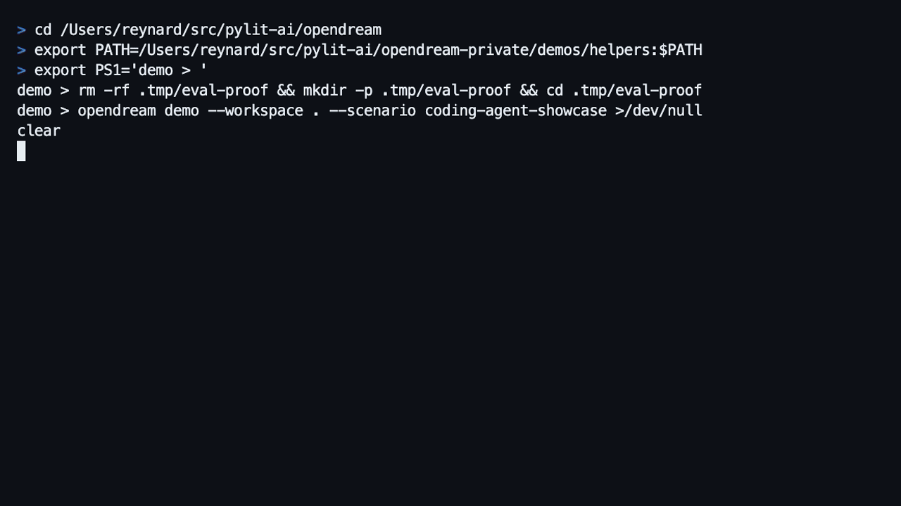

# OpenDream Memory Showcase

<p align="center">
  <picture>
    <source media="(prefers-color-scheme: dark)" srcset="../../frontend/assets/logo/wordmark/vector/opendream_wordmark_primary_ink_dark.svg">
    <source media="(prefers-color-scheme: light)" srcset="../../frontend/assets/logo/wordmark/vector/opendream_wordmark_primary_ink_light.svg">
    
  </picture>
</p>

This walkthrough creates a disposable, synthetic project-agent history and then demonstrates the full memory loop on the next task: objective -> prompt context -> selected memories -> source evidence -> dream/maintenance effects. It is meant for first-run demos, skeptical evaluation, and release checks.



## 90-second path

```bash
rm -rf .tmp/opendream-showcase
.venv/bin/python -m opendream.cli demo \
  --scenario agent-workspace-showcase \
  --workspace .tmp/opendream-showcase
```

Expected signal:

- `scenario` is `agent-workspace-showcase`
- `objective.title` explains what the demo is trying to prove
- `evaluation_case.user_prompt` is the project task that requires prior memory
- `context.prompt_context` shows the exact context OpenDream would inject
- `context.links` connects selected prompt memories to memory IDs and source events
- `before.selected_memory_ids` is empty
- `after.selected_memory_ids` is non-empty
- `agent_snippet` starts with `OpenDream found prior memory:`
- `agent_answers` compares measured stateless and memory-assisted answers
- `retrieval_rationale` explains why each memory was selected
- `claim_verification.trust_level` says whether retrieval, task success, dream value, and memory safety are all proven
- `memory_safety.risk_categories` checks stale overwrite, contaminated decoy, hallucinated source, contradiction, and abstention failures
- `agent_observability_trace` records memory reads/writes, context assembly, answer generation, and eval scoring as trace spans
- `dream_effectiveness` shows extraction, consolidation, stale-memory handling, decoy rejection, and prompt-context assembly
- `report_path` points at `.tmp/opendream-showcase/.opendream/memory/state/showcase_report.json`

## Skeptic validation

Run the hermetic eval. It uses an isolated store, so existing workspace memory does not affect the verdict.

```bash
.venv/bin/python -m opendream.cli eval showcase \
  --scenario agent-workspace-showcase \
  --workspace .tmp/opendream-showcase
```

Use `--now 2026-03-26T12:00:00Z` only when you need deterministic test output for snapshots or release evidence. For an interactive demo, omit `--now` so OpenDream uses the current clock.

Expected checks:

- `baseline_empty`: the empty store does not invent prior memory
- `recall`: the seeded store recalls package-manager and Redis requirements
- `stale_update`: the pnpm correction wins over the stale npm prototype decision
- `decoy_rejection`: unrelated GraphQL billing sandbox memory is not selected
- `provenance`: selected memories include source event refs
- `snippet`: the agent-facing recall phrase is generated
- `answer_improvement`: the memory-assisted answer passes measured answer checks and improves over the stateless baseline
- `memory_safety`: safety probes reject unsupported, stale, contradicted, and unrelated memory
- `claim_verification`: report-level claims resolve to pass/fail evidence instead of prose-only proof

## What the proof is proving

The objective is not merely that a memory ID appears. The showcase tests whether OpenDream can help an agent answer this project task correctly:

> You are about to update the OpenDream Observe UI for the memory showcase. Before editing, identify the repo-specific package manager, local service prerequisites, known failed approach, successful UI build step, and verification workflow.

A correct memory system should surface the current pnpm decision, Redis prerequisite, npm lockfile-drift anti-pattern, Observe UI rebuild workaround, and memory-showcase verification workflow. It should not use the stale npm prototype decision as current guidance, and it should not pull in the unrelated GraphQL billing decoy.

The report makes that inspectable:

- `evaluation_case`: task prompt, expected answer shape, and likely stateless failure
- `agent_answers`: stateless and memory-assisted answers scored against expected signals, forbidden stale guidance, and source grounding
- `context.prompt_context`: exact prompt context that would be sent to the agent
- `context.visibility`: selected, excluded, diagnostic-only, and startup-index-only classifications for assembled context
- `context.links`: selected prompt memories linked to source event IDs
- `retrieval_rationale`: score, matched evidence, inclusion reason, and status for each selected memory
- `claim_verification`: pass/fail for retrieval, task success, dream effectiveness, and memory safety claims
- `memory_safety`: negative controls for hallucinated source, stale overwrite, contaminated decoy, low-confidence promotion, contradiction, and abstention
- `agent_observability_trace`: run/session/context IDs plus span-style records for memory read/write, prompt context, answer generation, and eval scoring
- `copy_actions`: copyable command, report JSON URL, report path, and source fixture path
- `dream_effectiveness`: the maintenance pipeline from raw events to durable memory to prompt context

## Dream effectiveness

The showcase uses `opendream demo` to seed raw events and run the maintenance/dream path. The report records whether the system:

- extracted candidates from raw project-agent events
- consolidated those candidates into durable memories
- marked stale npm guidance as contested instead of treating it as current truth
- kept unrelated decoy memory out of selected durable memory and actionable prompt context
- preserved source provenance for selected memory
- assembled curated actionable prompt context from durable memory instead of dumping raw history

This mirrors current memory research practice: evaluate not only retrieval, but also update handling, noise rejection, temporal/current-state behavior, and whether consolidated memory improves the prompt context available to the agent.

## UI proof

```bash
.venv/bin/python -m opendream.cli observe serve --workspace .tmp/opendream-showcase
```

Open `/showcase`. The page reads the persisted showcase report and shows the objective, task prompt, exact injected prompt context, selected memories, retrieval rationale, source event evidence, dream/maintenance pipeline, and eval-style checks.

The first screen is meant to answer the skeptic question quickly:

- Memory system: retrieves useful prior facts.
- Dream system: consolidates events, contests stale guidance, and preserves source evidence.
- Trust level: strong only when retrieval, answer quality, dream effectiveness, and safety checks all pass.
- Reproducibility: command, report JSON, report path, fixture path, git commit, dirty status, and trace IDs are visible.

The page also includes a glossary for `durable memory`, `startup index`, `prompt context`, `contested`, `quarantined`, `superseded`, `source ref`, and `memory hurt`.

## Fixture

The synthetic fixture lives at `opendream/fixtures/showcase_agent_workspace_memory.jsonl`.

It covers:

- package manager preference
- environment requirement
- failed approach / anti-pattern
- successful workaround
- workflow step
- stale decision plus correction
- unrelated decoy memory

It also drives safety/misevolution probes: stale guidance that should lose to a correction, unrelated decoy memory that should not enter prompt context, forced contested recall that should be detected as harmful, and abstention prompts that should select no memory.

## Research anchors

Comparable memory systems make value visible through seeded recall, inspectable memory, or benchmark-style proof:

- [MemoryArena](https://digitaleconomy.stanford.edu/publication/memoryarena-benchmarking-agent-memory-in-interdependent-multi-session-agentic-tasks/) argues memory should be evaluated by whether earlier experience guides later action, not isolated memorization.
- [Memory for Autonomous LLM Agents](https://arxiv.org/abs/2603.07670) frames memory as a write-manage-read loop and calls out consolidation, causally grounded retrieval, contradiction handling, and trustworthy reflection as open challenges.
- [MemoryAgentBench](https://arxiv.org/abs/2507.05257) identifies accurate retrieval, test-time learning, long-range understanding, and selective forgetting as core memory-agent competencies.
- [LoCoMo-Plus](https://arxiv.org/abs/2602.10715) motivates testing latent constraints and not only surface factual recall.
- [OpenTelemetry AI agent observability](https://opentelemetry.io/blog/2025/ai-agent-observability/) motivates span-style traces for agent memory/tool/model steps.
- [Arize Phoenix evaluations](https://arize.com/docs/phoenix/evaluation/concepts-evals/evaluation) models retrieval evaluation with precision-like metrics, relevance, hallucination, and trace-linked evals.
- [ByteRover](https://arxiv.org/abs/2604.01599) emphasizes agent-native context, explicit provenance, hierarchical context, lifecycle scoring, and local-first storage.
- [Observational Memory](https://mastra.ai/research/observational-memory) demonstrates value by showing stable prompt context built from event-like observations and reflection, with compression rather than raw transcript stuffing.
- [Supermemory Research](https://supermemory.ai/research/) highlights LongMemEval categories that matter for real memory systems: preference, multi-session reasoning, knowledge updates, temporal reasoning, and noise filtering; it also discloses prompts/code for reproducibility.
- [ChatGPT Memory FAQ](https://help.openai.com/en/articles/8590148-memory-in-chatgpt)
- [Mem0 interactive memory demo](https://docs.mem0.ai/examples/mem0-demo)
- [Zep LangGraph memory example](https://help.getzep.com/ecosystem/langgraph-memory)
- [Letta archival memory panel](https://docs.letta.com/guides/ade/archival-memory)
- [Letta memory leaderboard](https://www.letta.com/blog/letta-leaderboard)
- [LongMemEval](https://arxiv.org/abs/2410.10813)
- [LoCoMo](https://arxiv.org/abs/2402.17753)
